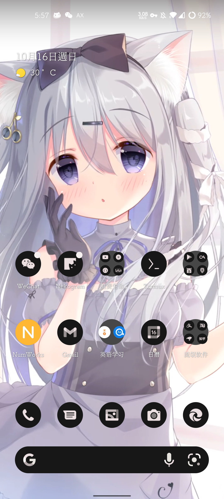
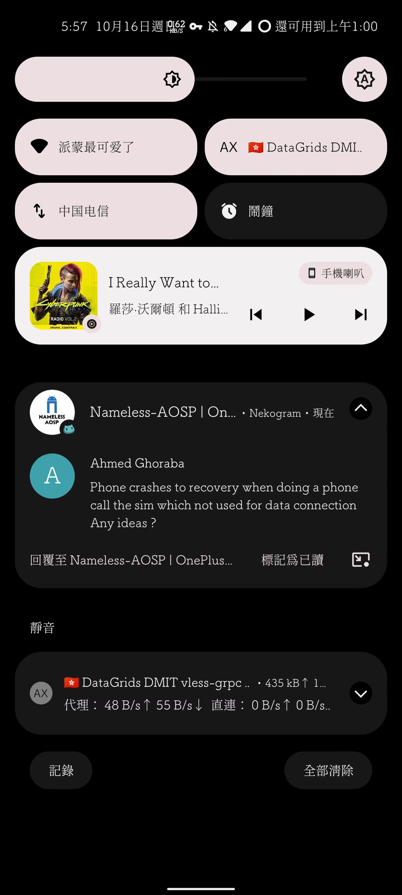
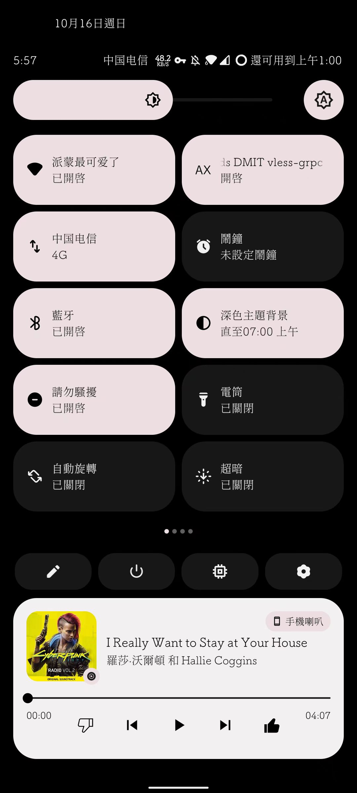
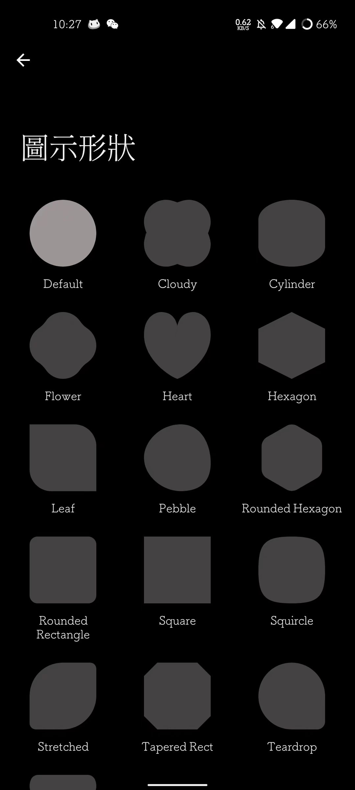
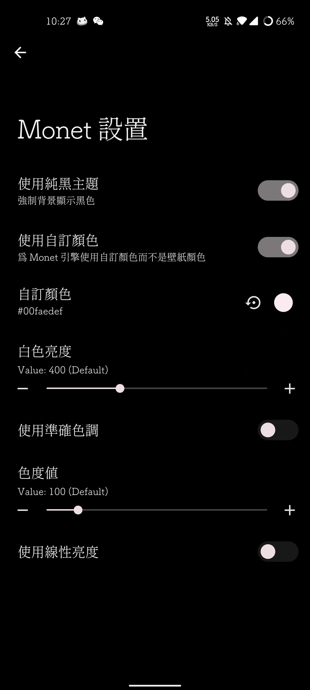
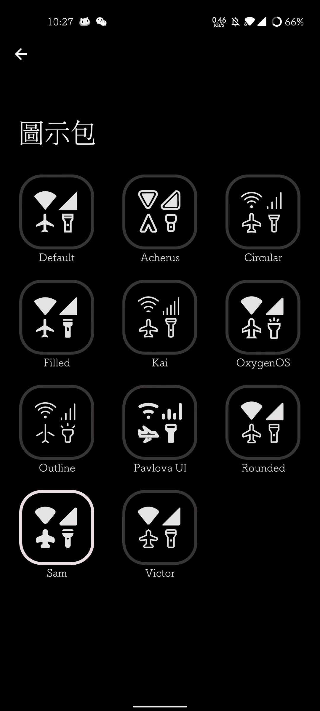

## 前言

一加8T已经被张老板抛弃呐，所以我打算尝试一下基于AOSP的第三方rom包。nameless作为一个只为一加789三系开发的rom得到了非常多加油的赞赏，因此我觉得抛弃早已断更的大氢，尝试nameless。不得不说，这次刷机过程存在非常多的坑，在这里十分感谢[Nameless-AOSP | OnePlus Hub](https://t.me/nameless_ophub)群里大佬们的帮助。

经过我一个月的深度使用（均基于android12，目前android13 nameless已发布），对比氢os，按照严重程度来排，已知问题：

> 1. 中国电信卡不能使用5G
>2. 间歇性出现闪屏，UI自动重启的问题
> 3. 游戏会可能会出现断触问题（这个看个人了，我一佛系玩家表示不在意）
>4. 软件通知声音和震动不能单独设定
> 5. 仅能使用前置亮度传感器，自动亮度不太准确
>6. 下拉菜单概率性掉帧
> 7. monet取色引擎由`kdrag0n`提供，与咕噜咕噜自己的monet引擎呈现效果不太一样（Android13不存在该问题，咕噜咕噜的引擎不支持自定义颜色，使用动态壁纸的时候可能会出现颜色识别错误的问题）
>7. 温控比氢os更为激进
> 7. 三段式开关可以被系统音量设置覆盖

较氢os11更好的地方：

> 1. 动画更跟手，反应更快
> 2. 不存在杀后台的问题
> 3. 基于android12，更及时的安全补丁
> 4. 更友好的社区环境
> 5. 刷magisk后不掉drm依然可以安装netflix
> 6. 氢os由于smart5G存在只能保持3分钟的5G连接

## 安装过程（需要官方系统作底包的手机通用）

我用我的主力机`OnePlus 8T`来尝鲜。刷第三方rom要注意区分该rom是否需要底包。nameless是需要`Oxygen OS`来作底包的，因此我们需要先将系统切换到氧os。

### 安装高通9008驱动

[点击下载](../files/Qualcomm USB Driver V1.0.exe)9008驱动，关闭windows驱动签名验证后安装该驱动。

### 9008线刷回氧os11

可以在[大侠阿木一加手机官方ROM下载](https://yun.daxiaamu.com/)找到自己手机的线刷救砖包，在这里我选择的是氧11的9008包。

1. 解压下载的9008包可以见到类似于下面的目录结构

```bash
Mode                LastWriteTime         Length Name
----                -------------         ------ ----
d----         2021/2/19     18:27                 DLLS
d----         2021/2/19     18:27                 UFS_FW
-a---          2021/2/2      3:25             83  build_path.txt
-a---          2021/2/2      3:25     6309788160  kebab_15_O.12_210201.ops
-a---          2021/2/2      3:24             58  md5sum_pack.md5
-a---          2021/2/2      3:25       13186048  MsmDownloadTool V4.0_factory.exe
-a---          2021/2/2      3:25       13479424  MsmDownloadTool V4.0_Win7.exe
-a---          2021/2/2      3:25       13504512  MsmDownloadTool V4.0.exe
```

2. 启动`MsmDownloadTool V4.0.exe`，选择other，进入后在左上角选择对应的手机系统。

3. 彻底关闭手机。可以通过长按电源键40s后等一分钟，或者进入fastboot模式选择`power off`来关闭手机

4. 手机进入EDL模式。同时按住音量+-两个按钮，不要松开，**保持按住状态连接手机和电脑**，这个手机手机还会保持黑屏。

5. 连接后`MsmDownloadTool`会显示手机，可点击左上方按钮`Enum`来刷新

6. 一切准备就绪后点击`Start`，直到进度条开始显示，才可以松开音量键。

7. 完成后手机将会自动重启，即完成刷机

### 更新手机系统和手机固件

1. 刷机完成后我们首先需要通过ota升级到最新的系统，如果手机没有推送可以自己在[大侠阿木一加手机官方ROM下载](https://yun.daxiaamu.com/)下载ota包然后本地更新。
2. 解锁手机，教程详见[magisk和xposed介绍](/shevon/magisk和xposed介绍)
3. 根据xda上的rom官方教程完成`recovery`的安装，到这里请大家停下来仔细阅读官方教程，若您的手机是A/B分区请确保在运行`adb sideload`之前，**已完成更新系统固件或克隆分区的操作**。下面的步骤针对需要更新系统固件或克隆分区的玩家。
   1. 更新系统固件。更新系统固件前请确保您的手机内存不会存在不同版本或您已经知道内存版本。这句话是对`OnepPlus 8T/9R`用户说的，因为这两款手机会抽奖DDR5和DDR4。Nameless官方提供了检测内存类型的[教程](https://docs.google.com/document/d/e/2PACX-1vRJAAkdpri_GL5Kw7z0j-SGyWdWwqHtSMkOFdFWL-fn-nZUhlg4Xj5BVQCJVAS1wKuxgm6E0SjaHfxp/pub)。下载最新版本的系统固件，进入新刷的fastboot使用`adb sideload`刷入固件更新包。
   2. 克隆A/B分区。大部分第三方rom都会推荐这个选项，可以有效避免刷错固件导致的**不可逆的硬件层面损坏**。下载官方教程提供的`copy-partitions.zip`包，同样使用新刷的fastboot并通过`adb sideload`刷入。
4. 重启手机并确保重启后能够成功进入系统。

### 刷入第三方rom

1. 下载第三方系统rom包，同样使用`adb sideload`刷入。
2. 在新刷入的recovery执行双清工作。
3. 重启
4. 根据需求使用`payload_dumper`等工具完成magisk的刷入，教程同[magisk和xposed介绍](/shevon/magisk和xposed介绍)

## 使用评测

<center>
	
	
	
	<br/>
</center>

真的我太爱`material you design`呢，真的好好看，我可以哭死。Android12的通知栏真的比旧版的好看太多了，非常灵动非常可爱，120hz的刷新率非常跟手，而且nameless的震动调教比一加好太多了，每次点击磁贴开关，动画过渡和马达震动同时开始又同时结束，震撼而又不失协调，轻快而又不失动感。

<center>
	
	
	
	<br/>
</center>
Nameless相比原生aosp拥有更多的自定义选项，


rom的作者专门设计了一个页面用来控制手机的其他选项，超赞，太有心了。

