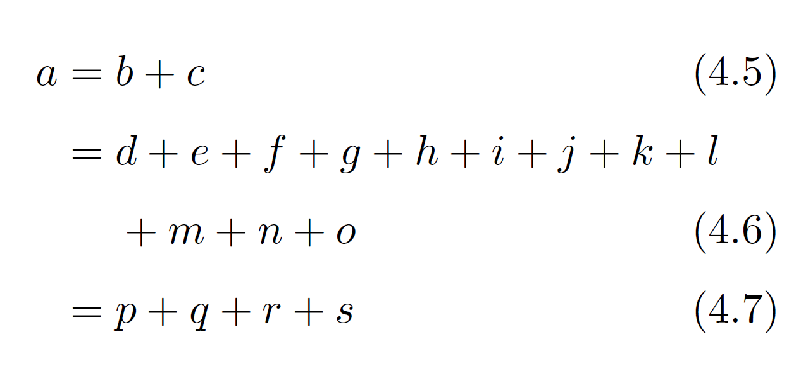
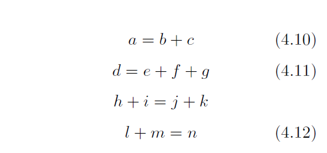
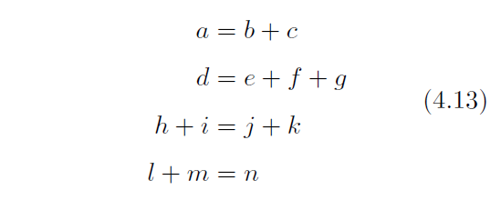

版本号: V1.6.6
---
**编者**
中山大学 易鹏
华南理工大学 关舒文
## 1 公式环境
**无论使用哪种公式,都请在文档的导言区加上`amsmath`宏包,即`\usepackage{amsmath}`.**
### 1.1 行间公式
行间公式是指单独开一行来专门放置公式. 有三种方式:
- 使用双美元符号
- 使用`\[ \]`
- 使用`equation`环境
```latex
$$ x^2+2x+1=0 $$
\[ x^2+2x+1=0 \]
```
其编译结果为
$$x^2+2x+1=0$$
\[ x^2+2x+1=0 \]
```latex
\begin{equation}
x^2+2x+1=0
\end{equation}
```
其编译结果为
$$
\begin{equation}
x^2+2x+1=0
\tag{1}
\end{equation}
$$
从上面两个编译结果来看,明显的,`equation`环境比直接使用`;&#36;&#36 ;&#36;&#36`多了自动编号功能,如果后面习惯了用`equation`环境而不想某个公式自动编号,则使用`equation*`环境,例如
```latex
\begin{equation*}
x^2+2x+1=0
\end{equation*}
```
其编译结果为
$$
\begin{equation*}
x^2+2x+1=0
\end{equation*}
$$
**对于`equation`环境还可以对公式进行标签和引用**,例如
```latex
\begin{equation} \label{eq1} %设置标签,方便引用
x^2+2x+1=0
\end{equation}
公式\eqref{eq1}是自动编号的.
公式\ref{eq1}是自动编号的.
```
$$
\begin{equation}
x^2+2x+1=0
\tag{2}
\label{eq1} %设置标签,方便引用
\end{equation}
$$

公式\eqref{eq1}是自动编号的.
公式\ref{eq1}是自动编号的.
公式的引用需要在`equation`环境中预先标签`\label{XXX}`,后面引用的时候用`\eqref{XXX}`或`\ref{XXX}`,它们的区别在于有没有`()`,后者常用于定理环境的引用,前者常用于公式环境,这两个`XXX`要一致(一个空格也不能差).

> 对于使用双美元符号和使用`\[ \]`,在LaTeX2e中我们较为推荐使用中括号的写法,这对间隔控制更友好.后者在定义上基本与`equation*`环境等价/
### 1.2 行内公式
顾名思义,行内公式就是公式和文字混排在一起,这个时候只需使用`$  $`,例如
```latex
物体的动能为$E=\frac{1}{2}mv^2$.
```
其编译结果为

物体的动能为$E={\scriptsize\frac{1}{2}}mv^2$.

你会发现1/2变小了,这是LaTex在排版时为了让公式美观,更贴合文字的大小,所以调小了1/2的大小,如果你想**使得行内公式的显示和行间公式一样,则在公式的最前面添加`\displaystyle`即可**,例如
```latex
物体的动能为$\displaystyle E=\frac{1}{2}mv^2$.
```
其编译结果为
物体的动能为$E=\frac{1}{2}mv^2$.

## 2 公式的基本输入
### 2.1 上下标
`^` 表示上标, `_` 表示下标.如果上下标的内容多于一个字符,需要用 `{}` 将这些内容括成一个整体.上下标可以嵌套,也可以同时使用.例如
```latex
$$ x^{y^z}=(1+{\rm e}^x)^{-2xy^w} $$
```
其编译结果为
$$ x^{y^z}=(1+{\rm e}^x)^{-2xy^w} $$
**如果要在左右两边都有上下标,可以用`\sideset`命令.**
例如
```latex
$$ \Delta S=S_2-S_1=\sideset{_R}{_{1}^{2}}{\int}\frac{\rm{d} Q}{T} $$
```
其编译结果为
$$ \Delta S=S_2-S_1=\sideset{_R}{_{1}^{2}}{\int}\frac{\rm{d} Q}{T} $$
从这个例子我们可以看出来,**`\sideset`的用法**为
```latex
\sideset{左边的上下标}{右边的上下标}{被标号的部分}`
```
### 2.2  括号和分隔符

`()`、`[]` 和 `|` 表示符号本身,使用 `\{\}`(转义字符) 来表示 `{}` .当要显示大号的括号或分隔符时,要用 `\left` 和 `\right` 命令使得括号的大小与公式高度匹配.

一些特殊的括号：

|输入|显示|输入|显示|
|:--:|:--:|:--:|:--:|
|\langle|$\langle$|\rangle|$\rangle$|
|\lceil|$\lceil$|\rceil|$\rceil$|
|\lfloor|$\lfloor$|\rfloor|$\rfloor$|
|\lbrace|$\lbrace$|\rbrace|$\rbrace$|

例如：
```latex
$$
f(x,y,z) = 3y^2z \left( 3+\frac{7x+5}{1+y^2} \right)
$$
```
其编译结果为
$$ f(x,y,z) = 3y^2z \left( 3+\frac{7x+5}{1+y^2} \right) $$

**注意:`\left`和`\right`要同时使用，所以当使用单边括号的时候要用 `\left.` 或 `\right.` 作为不显示括号的一侧.**

例如：
```latex
$$
\left. \frac{{\rm d}u}{{\rm d}x} \right| _{x=0}
$$
$$
\left[ 1,\frac 12 \right)
$$
```
其编译结果为
$$ \left. \frac{ {\rm d}u}{ {\rm d}x} \right| _{x=0} $$
$$\left[ 1,\frac 12 \right)$$
**如果你需要将行内显示的分隔符也根据高度自动调整,可以使用 `\middle` 命令**,例如
```latex
$$
\left\langle  
  q
\middle\|
  \frac{\frac{x}{y}}{\frac{u}{v}}
\middle| 
   p 
\right\rangle
$$


```
其编译结果为
$$
\left\langle  
  q
\middle\|
  \frac{\frac{x}{y}}{\frac{u}{v}}
\middle| 
   p 
\right\rangle
$$
$$
\left(\frac 12 \middle/ \frac 13\right)
$$
### 2.3 分数

通常使用 `\frac {分子} {分母}` 命令产生一个分数,分数可嵌套.
便捷情况（当分子和分母都仅有一个字符的情况）可直接输入 `\frac ab` 来快速生成一个 $\frac ab$(这种方法不仅适用于`\frac`) .
如果分式很复杂,亦可使用 `{分子 \over 分母}` 命令(不建议),此时分数仅有一层.

例如：
```latex
$$
\frac{a-1}{b-1} \quad and \quad {a+1\over b+1}
$$
```
其编译结果为
$$\frac{a-1}{b-1} \quad and \quad {a+1\over b+1}$$
对于行间公式环境中的分数,我们不仅可以使用`\displaystyle`以产生跨行的分数,还可以时使用`\dfrac`
例如:
```latex
小的$ \frac 12 $和大的$\dfrac 12 $
```
其编译结果为
小的$ \frac 12 $和大的$\dfrac 12 $
> 注意在行间公式环境中,第一层分数将会以`\displaystyle`显示,第二层将以`\textstyle`,字体大小逐级递减, 故若需要创建大小一致的分数形式,请使用不会改变字体显示样式的`\cfact`(详见下文连分数)
$$
x = a_0 + \frac{1^2}{a_1
          + \frac{2^2}{a_2
          + \frac{3^2}{a_3 + \frac{4^4}{a_4 + \cdots}}}}
$$

### 2.4 开方
使用 `\sqrt [根指数,省略时为2] {被开方数}` 命令输入开方. 同时`\sqrt`命令亦可以使用简略的书写方法,但根指数依然要使用中括号.

例如:
```latex
$$
\sqrt{2} \quad and \quad \sqrt[n]{3}
$$
$$
\sqrt[n]m
$$
```
其编译结果为
$$\sqrt{2} \quad and \quad \sqrt[n]{3}$$
$$
\sqrt[n]m
$$
### 2.5 省略号与点
省略号常用于矩阵环境和列举环境.

|输入|显示|说明|
|:--:|:--:|:--:|
|\cdot|$\cdot$|点乘|
|\cdots|$\cdots$|水平省略号|
|\vdots|$\vdots$|竖直省略号|
|\ddots|$\ddots$|对角省略号|
|\ldots|$\ldots$|跟文本底线对齐|

例如：
```latex
$$
f(x_1,x_2,\underbrace{\ldots}_{\rm ldots} ,x_n) = x_1^2 + x_2^2 + \underbrace{\cdots}_{\rm cdots} + x_n^2
$$
```
其编译结果为
$$f(x_1,x_2,\underbrace{\ldots}_{\rm ldots} ,x_n) = x_1^2 + x_2^2 + \underbrace{\cdots}_{\rm cdots} + x_n^2$$

### 2.6 矢量与方向

使用 `\vec{矢量}` 来自动产生一个矢量.也可以使用 `\overrightarrow` 生成自动根据内容调节长度的向量箭头

例如：
```latex
$$
\vec{a} \cdot \vec{b}=0
$$
$$
\overrightarrow{ABCD}, \vec{ABCD}
$$
```

其编译结果为
$$\vec{a} \cdot \vec{b}=0$$
$$
\overrightarrow{ABCD}, \vec{ABCD}
$$
例如：
```latex
$$
\overleftarrow{xy} \quad and \quad \overleftrightarrow{xy} \quad and \quad \overrightarrow{xy}
$$
```
其编译结果为
$$\overleftarrow{xy} \quad and \quad \overleftrightarrow{xy} \quad and \quad \overrightarrow{xy}$$

### 2.7 积分

使用 `\int_{积分下限}^{积分上限} {被积表达式}` 来输入一个积分.多重积分使用`\iint`或者其他.

例如：
```latex
$$
\int_0^1 {x^2} \,{\rm d}x
$$
```
其编译结果为
$$\int_{0}^{m^2} {x^2} \,{\rm d}x$$

本例中`{\rm }`表示对括号部分的公式取消斜体,`\,`表示一个小空格, 根据IEEE出版物规定,建议使用正体微分符号,被积变量与被积函数之间以空格相隔.

### 2.8 极限

使用 `\lim_{变量 \to 表达式} 表达式` 来输入一个极限.如有需求,可以更改 `\to` 符号至任意符号.

例如：
```latex
$$ 
\lim_{n \to +\infty} \frac{1}{n(n+1)} \quad and \quad \lim_{x\leftarrow{示例}} \frac{1}{n(n+1)} 
$$
```

其编译结果为
$$\lim_{n \to +\infty} \frac{1}{n(n+1)} \quad and \quad \lim_{x\leftarrow{示例}} \frac{1}{n(n+1)}$$
有时候我们可能会用到多重极限或者具有层叠结构的数学表达式,这时候我们可以使用`\atop`命令来构造层叠结构
```latex
$$ \lim_{z\to 0 \atop z\in D}f(x,y)$$
```
其编译结果为
$$ \lim_{z\to 0 \atop z\in D}f(x,y)$$
对于积分符号也同样适用
```latex
$$ \iint\limits_{-1<x<1>\atop -1<y<1}f(x,y)\,{\rm d} x $$
```
$$ \iint\limits_{-1<x<1\atop -1<y<1}f(x,y)\,{\rm d} x $$
> `\limits`命令可以实现将下标放在符号正下方的功能.
### 2.9 累加、累乘运算

使用 `\sum_{下标表达式}^{上标表达式} {累加表达式}` 来输入一个累加.
与之类似,使用 `\prod` `\bigcup` `\bigcap` 来分别输入累乘、并集和交集.
此类符号在行内显示时上下标表达式将会移至右上角和右下角.

- 例子：
```latex
$$
\sum_{i=1}^n \frac{1}{i^2} \quad and \quad \prod_{i=1}^n \frac{1}{i^2} \quad and \quad \bigcup_{i=1}^{2} R
$$
```

- 显示：$$\sum_{i=1}^n \frac{1}{i^2} \quad and \quad \prod_{i=1}^n \frac{1}{i^2} \quad and \quad \bigcup_{i=1}^{2} R$$

### 2.10 希腊字母

输入 `\小写希腊字母英文全称` 和 `\首字母大写希腊字母英文全称` 来分别输入小写和大写希腊字母.
**对于大写希腊字母与现有字母相同的,直接输入大写字母即可.**

|输入|显示|输入|显示|输入|显示|输入|显示|
|:--:|:--:|:--:|:--:|:--:|:--:|:--:|:--:|
|\alpha|$\alpha$|A|$A$|\beta|$\beta$|B|$B$|
|\gamma|$\gamma$|\Gamma|$\Gamma$|\delta|$\delta$|\Delta|$\Delta$|
|\epsilon|$\epsilon$|E|$E$|\zeta|$\zeta$|Z|$Z$|
|\eta|$\eta$|H|$H$|\theta|$\theta$|\Theta|$\Theta$|
|\iota|$\iota$|I|$I$|\kappa|$\kappa$|K|$K$|
|\lambda|$\lambda$|\Lambda|$\Lambda$|\mu|$\mu$|M|$M$|
|\nu|$\nu$|N|$N$|\xi|$\xi$|\Xi|$\Xi$|
|o|$o$|O|$O$|\pi|$\pi$|\Pi|$\Pi$|
|\rho|$\rho$|P|$P$|\sigma|$\sigma$|\Sigma|$\Sigma$|
|\tau|$\tau$|T|$T$|\upsilon|$\upsilon$|\Upsilon|$\Upsilon$|
|\phi|$\phi$|\Phi|$\Phi$|\chi|$\chi$|X|$X$|
|\psi|$\psi$|\Psi|$\Psi$|\omega|$\omega$|\Omega|$\Omega$|

**部分字母有变量专用形式,以 `\var-` 开头.**

|小写形式|大写形式|变量形式|显示|
|:--:|:--:|:--:|:--:|
|\epsilon|E|\varepsilon|$\epsilon \mid E \mid \varepsilon$|
|\theta|\Theta|\vartheta|$\theta \mid \Theta \mid \vartheta$|
|\rho|P|\varrho|$\rho \mid P \mid \varrho$|
|\sigma|\Sigma|\varsigma|$\sigma \mid \Sigma \mid \varsigma$|
|\phi|\Phi|\varphi|$\phi \mid \Phi \mid \varphi$|

### 2.11 其它特殊字符

> **若需要显示更大或更小的字符,在符号前插入 `\large` 或 `\small` 命令.**

> 若找不到需要的符号,使用 [$\rm{Detexify}$](http://detexify.kirelabs.org/classify.html) 来画出想要的符号.

> 也可以在LaTex自带的宏包说明中找到相应的符号,见附件.

#### 1．关系运算符

|输入|显示|输入|显示|输入|显示|输入|显示|
|:--:|:--:|:--:|:--:|:--:|:--:|:--:|:--:|
|\pm|$\pm$|\times|$\times$|\div|$\div$|\mid|$\mid$|
|\nmid|$\nmid$|\cdot|$\cdot$|\circ|$\circ$|\ast|$\ast$|
|\bigodot|$\bigodot$|\bigotimes|$\bigotimes$|\bigoplus|$\bigoplus$|\leq|$\leq$|
|\geq|$\geq$|\neq|$\neq$|\approx|$\approx$|\equiv|$\equiv$|
|\sum|$\sum$|\prod|$\prod$|\coprod|$\coprod$|\backslash|$\backslash$|

#### 2．集合运算符

|输入|显示|输入|显示|输入|显示|
|:--:|:--:|:--:|:--:|:--:|:--:|
|\emptyset|$\emptyset$|\in|$\in$|\notin|$\notin$|
|\subset|$\subset$|\supset|$\supset$|\subseteq|$\subseteq$|
|\supseteq|$\supseteq$|\bigcap|$\bigcap$|\bigcup|$\bigcup$|
|\bigvee|$\bigvee$|\bigwedge|$\bigwedge$|\biguplus|$\biguplus$|

#### 3．对数运算符

|输入|显示|输入|显示|输入|显示|
|:--:|:--:|:--:|:--:|:--:|:--:|
|\log|$\log$|\lg|$\lg$|\ln|$\ln$|

#### 4．三角运算符

|输入|显示|输入|显示|输入|显示|
|:--:|:--:|:--:|:--:|:--:|:--:|
|30^\circ|$30^\circ$|\bot|$\bot$|\angle A|$\angle A$|
|\sin|$\sin$|\cos|$\cos$|\tan|$\tan$|
|\csc|$\csc$|\sec|$\sec$|\cot|$\cot$|

#### 5．微积分运算符

|输入|显示|输入|显示|输入|显示|
|:--:|:--:|:--:|:--:|:--:|:--:|
|\int|$\int$|\iint|$\iint$|\iiint|$\iiint$|
|\iiiint|$\iiiint$|\oint|$\oint$|\prime|$\prime$|
|\lim|$\lim$|\infty|$\infty$|\nabla|$\nabla$|

#### 6．逻辑运算符

|输入|显示|输入|显示|输入|显示|
|:--:|:--:|:--:|:--:|:--:|:--:|
|\because|$\because$|\therefore|$\therefore$|
|\forall|$\forall$|\exists|$\exists$|\not\subset|$\not\subset$|
|\not<|$\not<$|\not>|$\not>$|\not=|$\not=$|

#### 7．戴帽符号

|输入|显示|输入|显示|
|:--:|:--:|:--:|:--:|
|\hat{xy}|$\hat{xy}$|\widehat{xyz}|$\widehat{xyz}$|
|\tilde{xy}|$\tilde{xy}$|\widetilde{xyz}|$\widetilde{xyz}$|
|\check{x}|$\check{x}$|\breve{y}|$\breve{y}$|
|\grave{x}|$\grave{x}$|\acute{y}|$\acute{y}$|


#### 8．连线符号
|输入|显示|
|:--:|:--:|
|\fbox{a+b+c+d}|$\fbox{a+b+c+d}$|
|\overleftarrow{a+b+c+d}|$\overleftarrow{a+b+c+d}$|
|\overrightarrow{a+b+c+d}|$\overrightarrow{a+b+c+d}$|
|\overleftrightarrow{a+b+c+d}|$\overleftrightarrow{a+b+c+d}$|
|\underleftarrow{a+b+c+d}|$\underleftarrow{a+b+c+d}$|
|\underrightarrow{a+b+c+d}|$\underrightarrow{a+b+c+d}$|
|\underleftrightarrow{a+b+c+d}|$\underleftrightarrow{a+b+c+d}$|
|\overline{a+b+c+d}|$\overline{a+b+c+d}$|
|\underline{a+b+c+d}|$\underline{a+b+c+d}$|
|\overbrace{a+b+c+d}^{Sample}|$\overbrace{a+b+c+d}^{Sample}$|
|\underbrace{a+b+c+d}_{Sample}|$\underbrace{a+b+c+d}_{Sample}$|
|\overbrace{a+\underbrace{b+c}_{1.0}+d}^{2.0}|$\overbrace{a+\underbrace{b+c}_{1.0}+d}^{2.0}$|
|\underbrace{a\cdot a\cdots a}_{b\text{ times}}|$\underbrace{a\cdot a\cdots a}_{b\text{ times}}$|
|\underrightarrow{1℃/min} | $\underrightarrow{1℃/min}$ |

#### 9．箭头符号

推荐使用符号：

|输入|显示|输入|显示|输入|显示|
|:--:|:--:|:--:|:--:|:--:|:--:|
|\to|$\to$|\mapsto|$\mapsto$|
|\implies|$\implies$|\iff|$\iff$|\impliedby|$\impliedby$|


其它可用符号：

|输入|显示|输入|显示|
|:--:|:--:|:--:|:--:|
|\uparrow|$\uparrow$|\Uparrow|$\Uparrow$|
|\downarrow|$\downarrow$|\Downarrow|$\Downarrow$|
|\leftarrow|$\leftarrow$|\Leftarrow|$\Leftarrow$|
|\rightarrow|$\rightarrow$|\Rightarrow|$\Rightarrow$|
|\leftrightarrow|$\leftrightarrow$|\Leftrightarrow|$\Leftrightarrow$|
|\longleftarrow|$\longleftarrow$|\Longleftarrow|$\Longleftarrow$|
|\longrightarrow|$\longrightarrow$|\Longrightarrow|$\Longrightarrow$|
|\longleftrightarrow|$\longleftrightarrow$|\Longleftrightarrow|$\Longleftrightarrow$|

## 4 矩阵
### 4.1 矩阵的基本用法
矩阵有很多的打法,这里只讲述最常用的一种,先举个例子.
```latex
$$
\left[ %左括号
\begin{array}[cccc] %[cccc]表示的是一行有4列,c代表的是居中
    a_{11} & a_{12} & a_{13} & a_{14} \\ %每行的&分割列,\\代表换行
    a_{21} & a_{22} & a_{23} & a_{24} \\
    a_{31} & a_{32} & a_{33} & a_{34} \\
    a_{41} & a_{42} & a_{43} & a_{44} 
\end{array}
\right] %右括号
$$
```
其编译结果为
$$
\left[
\begin{array}[cccc]
    aa_{11} & a_{12} & a_{13} & a_{14} \\
    a_{21} & a_{22} & a_{23} & a_{24} \\
    a_{31} & a_{32} & a_{33} & a_{34} \\
    a_{41} & a_{42} & a_{43} & a_{44} 
\end{array}
\right]
$$
我们来分析上面的代码,`\left[  \right]`就是我们所看到的两个打括号,而中间的`array`环境是表格环境,`[cccc]`表示的是一行有4列,c代表的是居中,c可以替换为l(左对齐)、r(右对齐).结合省略号,可以构造一个一般矩阵,例如
```latex
$$
\left[
\begin{array}[cccc]
    a_{11} & a_{12} & \cdots & a_{1n} \\
    a_{21} & a_{22} & \cdots & a_{2n} \\
    \vdots & \vdots & \ddots & \vdots \\
    a_{n1} & a_{n2} & \cdots & a_{nn} 
\end{array}
\right]
$$
```
其编译结果为
$$
\left[
\begin{array}[cccc]
    aa_{11} & a_{12} & \cdots & a_{1n} \\
    a_{21} & a_{22} & \cdots & a_{2n} \\
    \vdots & \vdots & \ddots & \vdots \\
    a_{n1} & a_{n2} & \cdots & a_{nn} 
\end{array}
\right]
$$

amsmath 宏包还直接提供了多种排版矩阵的
环境，包括不带定界符的matrix，以及带各种定界符的矩阵pmatrix（$($）、bmatrix（$[$）、Bmatrix（$\lbrace$）、vmatrix（$|$）、Vmatrix（$\|$）。使用这些环境时，无需给定列格式:
```latex
$$
\begin{matrix}
    1 & 2 \\ 3 & 4
\end{matrix} \qquad
\begin{bmatrix}
    x_{11} & x_{12} & \ldots & x_{1n}\\
    x_{21} & x_{22} & \ldots & x_{2n}\\
    \vdots & \vdots & \ddots & \vdots\\
    x_{n1} & x_{n2} & \ldots & x_{nn}\\
\end{bmatrix}
$$
```
其编译结果为
$$
\begin{matrix}
1 & 2 \\ 3 & 4
\end{matrix} \qquad
\begin{bmatrix}
    x_{11} & x_{12} & \ldots & x_{1n}\\
    x_{21} & x_{22} & \ldots & x_{2n}\\
    \vdots & \vdots & \ddots & \vdots\\
    x_{n1} & x_{n2} & \ldots & x_{nn}\\
\end{bmatrix}
$$
在矩阵中的元素里排版分式时，一来要用到\dfrac 等命令，二来行与行之间有可能紧贴着，
这时也要调节间距：
```latex
$$
\mathbf{H}=
\begin{bmatrix}
    \dfrac{\partial^2 f}{\partial x^2} &
    \dfrac{\partial^2 f}
    {\partial x \partial y} \\[8pt]
    \dfrac{\partial^2 f}
    {\partial x \partial y} &
    \dfrac{\partial^2 f}{\partial y^2}
\end{bmatrix}
$$
```
其编译结果为
$$
\mathbf{H}=
\begin{bmatrix}
    \dfrac{\partial^2 f}{\partial x^2} &
    \dfrac{\partial^2 f}
    {\partial x \partial y} \\[8pt]
    \dfrac{\partial^2 f}
    {\partial x \partial y} &
    \dfrac{\partial^2 f}{\partial y^2}
\end{bmatrix}
$$

## 5 方程组
方程组可以直接用`cases`环境直接打出,例如
```latex
$$
\begin{cases} %开始cases环境
    x+y=1 \\ %\\换行
    x-y=1
\end{cases}
$$
```
其编译结果如下
$$
\begin{cases}
    x+y=1 \\
    x-y=1
\end{cases}
$$

## 6 公式优化
### 6.1 数学字体

若要对公式的某一部分字符进行字体转换,可以用 `{\字体 {需转换的部分字符}}` 命令,其中 `\字体` 部分可以参照下表选择合适的字体.一般情况下,公式默认为意大利体 $italic$ .

示例中 **全部大写** 的字体仅大写可用.

|输入|说明|显示|输入|说明|显示|
|:--:|:--:|:--:|:--:|:--:|:--:|:--:|
|\mathrm|罗马体|$\mathrm{Sample}$|\cal|花体|$\cal{SAMPLE}$|
|\mathit|意大利体|$\mathit{Sample}$|\Bbb|黑板粗体|$\Bbb{SAMPLE}$|
|\mathbf|粗体|$\mathbf{Sample}$|\mit|数学斜体|$\mit{SAMPLE}$|
|\mathsf|等线体|$\mathsf{Sample}$|\scr|手写体|$\scr{SAMPLE}$|
|\mathtt|打字机体|$\mathtt{Sample}$|
|\mathfrak|旧德式字体|$\mathfrak{Sample}$|


转换字体十分常用,例如在积分中：

例如：
```latex
\begin{array}{cc}
\mathrm{Bad} & \mathrm{Better} \\
\hline \\
\int_0^1 x^2 dx & \int_0^1 x^2 \,{\rm d}x
\end{array}
```

其编译结果为
$$
\begin{array}{cc}
\mathrm{Bad} & \mathrm{Better} \\
\hline \\
\int_0^1 x^2 dx & \int_0^1 x^2 \,{\rm d}x
\end{array}
$$

注意比较两个式子间 $dx$ 与 ${\rm d} x$ 的不同.
使用 `\operatorname` 命令也可以达到相同的效果.

### 6.2 自动编号与手动编号
手动编号仅需在打完的公式后边加上`\tag{编号}`,例如
```latex
$$
f\left(
   \left[ 
     \frac{
       1+\left\{x,y\right\}
     }{
       \left(
          \frac{x}{y}+\frac{y}{x}
       \right)
       \left(u+1\right)
     }+a
   \right]^{3/2}
\right)
\tag{行标}
$$
```
其编译结果为
$$
f\left(
   \left[ 
     \frac{
       1+\left\{x,y\right\}
     }{
       \left(
          \frac{x}{y}+\frac{y}{x}
       \right)
       \left(u+1\right)
     }+a
   \right]^{3/2}
\right)
\tag{行标}
$$

对于自动编号,前面已经提过,在`equation`环境中会自动编号,有时我们会将其与章节相关联起来,我们可以在`tex`文件的导言区加上amsmath宏包后再添加命令`\numberwithin{equation}{section}​​`,这样我们的公式就可以变为如下的形式
$$
f\left(
   \left[ 
     \frac{
       1+\left\{x,y\right\}
     }{
       \left(
          \frac{x}{y}+\frac{y}{x}
       \right)
       \left(u+1\right)
     }+a
   \right]^{3/2}
\right)
\tag{1.1}
$$

### 6.3 公式断行
公式有的时候太长或是连等式需要手动断行,这个时候可以使用`split`环境(需要和`equation`环境同时使用).例如,
```latex
$$
\begin{split}
    1+2+3+4+5+6+7+\\
    +8+9+10+11+12+13=91.
\end{split}
$$
```
其编译结果为
$$
\begin{split}
    1+2+3+4+5+6+7 \\
    +8+9+10+11+12+13=91.
\end{split}
$$
当式子为连等式的时候需要对齐,这个时候我们会用上`&`来匹配每行的位置以达到对齐的效果.例如
```latex
$$
\begin{split}
      1+2+3+4+5+6+7
    &=3+3+4+5+6+7 \\
    &=6+4+5+6+7 \\
    &=10+5+6+7 \\
    &=15+6+7 \\
    &=21+7 \\
    &=28
\end{split}
$$
```
其编译结果为
$$
\begin{split}
      1+2+3+4+5+6+7
    &=3+3+4+5+6+7 \\
    &=6+4+5+6+7 \\
    &=10+5+6+7 \\
    &=15+6+7 \\
    &=21+7 \\
    &=28
\end{split}
$$
当然也可以写成这样
```latex
$$
\begin{split}
    &\,\,\,\,\,\,\,\,1+2+3+4+5+6+7
    &=3+3+4+5+6+7 \\
    &=6+4+5+6+7 \\
    &=10+5+6+7 \\
    &=15+6+7 \\
    &=21+7 \\
    &=28
\end{split}
$$
```
其编译结果为
$$
\begin{split}
    &\,\,\,\,\,\,\,\,1+2+3+4+5+6+7\\
    &=3+3+4+5+6+7 \\
    &=6+4+5+6+7 \\
    &=10+5+6+7 \\
    &=15+6+7 \\
    &=21+7 \\
    &=28
\end{split}
$$
以上稍微引入了多行公式的概念,下面我们详细讲讲多行公式.目前我们最常用的是`align`多行公式环境,它不需要外套`equation`环境,并且可以实现自动编号.
```latex
\begin{align}
    a ={} & b + c \\
    ={} & d + e + f + g + h + i
    + j + k + l \notag \\
    & + m + n + o \\
    ={} & p + q + r + s
\end{align}
```

其编译结果为

若只需要居中对齐公式我们可以选择`gather`环境
```latex
\begin{gather}
    a = b + c \\
    d = e + f + g \\
    h + i = j + k \notag \\
    l + m = n
\end{gather}
```
其编译结果为

若需要对同一个align环境使用一个编号而不是多个编号,我们可以使用`aligned`,`gathered`环境(此时需要和`equation`环境同时使用).
```latex
\begin{equation}
    \begin{aligned}
        a &= b + c \\
        d &= e + f + g \\
        h + i &= j + k \\
        l + m &= n
    \end{aligned}
\end{equation}
```
其编译结果为

### 6.4 连分数

就像输入分式时使用 `\frac` 一样,使用 `\cfrac` 来创建一个连分数.例如,
```latex
$$
x = a_0 + \cfrac{1^2}{a_1
          + \cfrac{2^2}{a_2
          + \cfrac{3^2}{a_3 + \cfrac{4^4}{a_4 + \cdots}}}}
$$
```
其编译结果为
$$
x = a_0 + \cfrac{1^2}{a_1
          + \cfrac{2^2}{a_2
          + \cfrac{3^2}{a_3 + \cfrac{4^4}{a_4 + \cdots}}}}
$$

不要使用普通的 `\frac` 或 `\over` 来创建,否则会看起来 **很奇怪** .例如,
```latex
$$
x = a_0 + \frac{1^2}{a_1
          + \frac{2^2}{a_2
          + \frac{3^2}{a_3 + \frac{4^4}{a_4 + \cdots}}}}
$$
```
其编译结果为
$$
x = a_0 + \frac{1^2}{a_1
          + \frac{2^2}{a_2
          + \frac{3^2}{a_3 + \frac{4^4}{a_4 + \cdots}}}}
$$

当然,你可以使用 `\frac` 来表达连分数的 **紧缩记法** .例如,
```latex
$$
x = a_0 + \frac{1^2}{a_1+}
          \frac{2^2}{a_2+}
          \frac{3^2}{a_3 +} \frac{4^4}{a_4 +} \cdots
$$
```
其编译结果为
$$
x = a_0 + \frac{1^2}{a_1+}
          \frac{2^2}{a_2+}
          \frac{3^2}{a_3 +} \frac{4^4}{a_4 +} \cdots
$$
连分数通常都太大以至于不易排版,所以建议在连分数前后声明 `$$` 符号,或使用像 `[a0;a1,a2,a3,…]` 一样的紧缩记法.

### 6.5 公式中输入中文
使用`\mbox{中文}`命令输入中文.例如,
```latex
$$
\sqrt{4} \, \mbox{或} \, 2
$$
```
其编译结果为
$$
\sqrt{4} \, \mbox{或} \, 2
$$

### 6.6 粗斜体
在给公式加粗体的时候,我们会发现字体变成正体了而不是斜体了.例如,
```latex
$$
\bf{xyz}
$$
```
其编译结果为
$$
\bf{xyz}
$$
如果想导出粗斜体,则需要在导言区的部分导入宏包`amsmath`的时候再导入`amsmath`自带的加粗宏包`bm`,**即`\usepackage{amsmath,bm}`**,这个时候使用命令`\bm{}`即可,例如
```latex
\bm{xyz}
```
其编译结果为
$$
\boldsymbol{xyz}
$$