## 前言
安卓11系统为ROOT带来了不少困难，但是magisk开发者还是非常及时的解决了11的兼容性问题，并成功为安卓11带来了magisk生态，随后便是xposed框架的适配。我在2020年双十一购入一加8T，到手后便解BL锁，并刷入了Magisk。起初Magisk上没有多少模组能够成功刷入或刷入后兼容性不强。12月左右EdXposed的canary分支声称首发支持安卓11，可以成功刷入但是xposed框架并没有完全启用，对于我这种强迫症来说显然很不爽。最终在2021年春节前后，各大模块开始涌现，Edxposed和lsposed的稳定分支也完美适配了安卓11系统，在这里感谢开发者们为我们带来了这么多快乐。

在这里不再赘述ROOT是什么以及ROOT的优缺点，从下面开始全是干货。

**刷机有风险，请做好备份并确保已经清楚刷机的后果（包括但不限于微信不再适用指纹支付）**

## 准备
从这里开始您必须清楚，该过程可能会导致手机数据丢失，开始前请备份数据备份数据备份数据。

### Android 调试桥 (adb)<sup>[1]</sup>准备
#### 介绍
Android 调试桥 (adb) 是一种功能多样的命令行工具，可让您与设备进行通信。adb 命令可用于执行各种设备操作（例如安装和调试应用），我们将适用adb获取系统的操作权限以进行后续工作
#### Android SDK Platform Tools 准备
1. 点击以下链接并根据自己的系统选择相应的SDK Platform Tools下载。
<https://developer.android.google.cn/studio/releases/platform-tools>
2. 完整解压后使用命令行进入该文件夹该文件夹有以下内容
    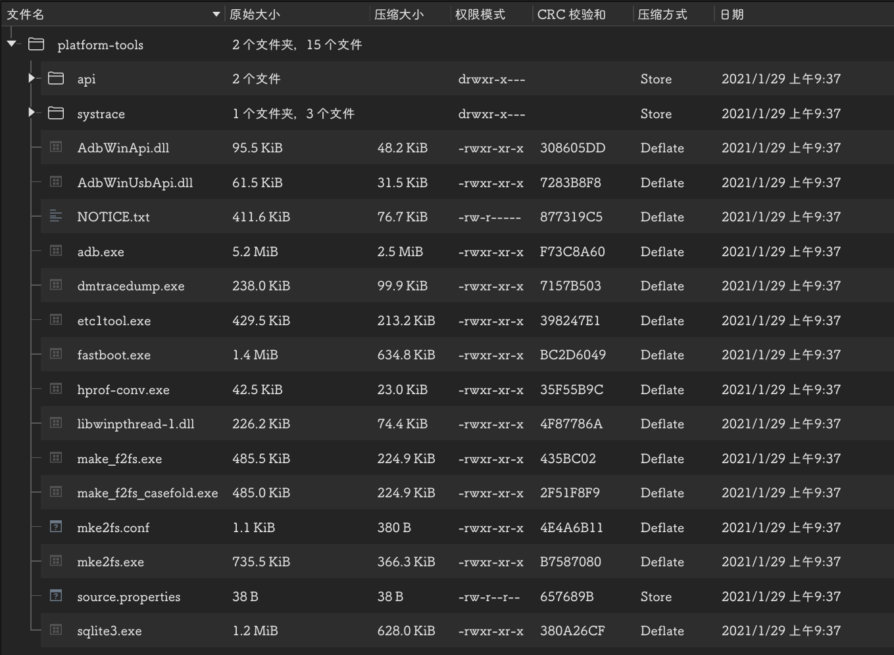
3. 在设备上启用USB调试
    在搭载 Android 4.2 及更高版本的设备上，“开发者选项”屏幕默认情况下处于隐藏状态。如需将其显示出来，请依次转到设置 > 关于手机，然后点按版本号七次。返回上一屏幕，在底部可以找到开发者选项。
    > 在某些设备上，“开发者选项”屏幕所在的位置或名称可能有所不同。
4. 将手机连接到电脑并等待电脑自动安装驱动。当系统提示设备已就绪时，您可以通过从 `platform-tools/` 目录执行 `adb devices` 来验证设备的连接状态（版本较新的系统会提示是否允许调试，请点确定并重新执行 `adb devices` 来验证设备的连接状态）。如果已连接，您将看到设备名称以“设备”形式列出，
    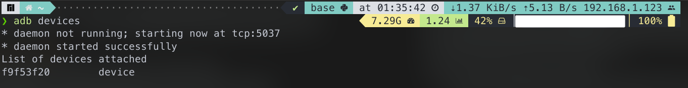
    手机通知菜单将会显示如下提示
    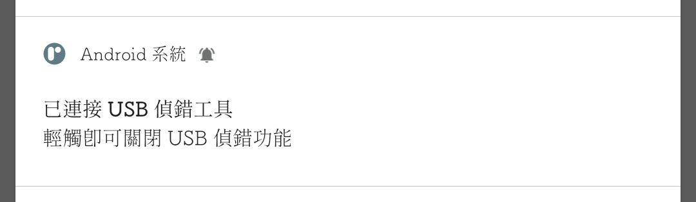

### 系统镜像准备
1. 在一加手机官网下载氢os镜像并请确保版本号与您的手机一致

    

    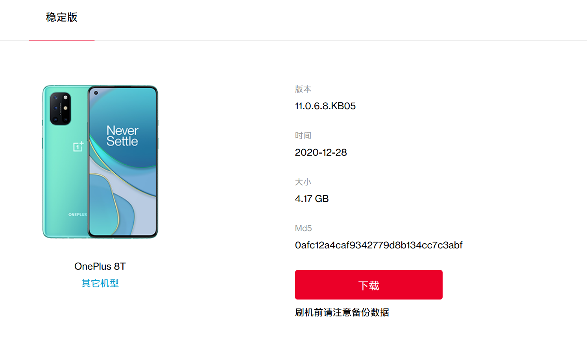
    > 若版本号不一致请先更新手机系统，以免出现无法开机的现象。

    氢os镜像下载地址<https://www.oneplus.com/cn/support/softwareupgrade>


## 开始之前
至此您已完成所有准备工作，从这里开始，将会介绍ROOT原理，magisk和xposed的使用等。
### 原理介绍
#### 安卓启动过程<sup>[2]</sup>
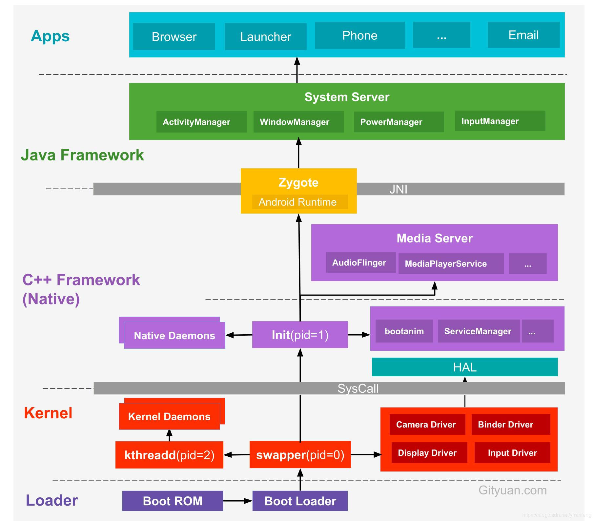
如图所示，Bootloader在安卓系统的启动过程中起到引导启动的作用，同时`boot.img`将会挂载`system.img`作为`/system`。
另外从Android 9开始，系统支持A/B处理方法，下面将介绍A/B设备：
- 支持A/B的设备（如8T）：系统在磁盘空间上划分为两个Slot：`Slot A`和`Slot B`。需要独立升级的分区（boot、recovery、system、radio、vendor等）在每个Slot上都会存在一个分区。例如boot会存在`boot_a`和`boot_b`两个分区，一个做为当前工作分区，另一个做为备份分区。OTA升级时，会在备份的Slot上更新，更新成功后将当前工作Slot进行切换，类似一种乒乓工作模式。
- 不支持A/B的设备：使用旧Android系统的分区方式。OTA升级时在recovery模式下通过cache分区进行更新。

#### Magisk 原理
从上面的介绍当中，我们可以知道boot.img有着挂载system.img的能力，不妨尝试修改boot.img并挂载一个伪system.img以实现间接使用已修改的/system。

magisk，台湾学生吴泓霖（John Wu，github为topjohnwu）开发的一种systemless实现方式，正是使用了这种思路。

其具体实现原理如下图(shevon版权所有)。通过修改`boot.img`，把原先的`system.img`挂载过程改为挂载`/data/magisk.img`到`/magisk`，构建出一个在原生system基础上能够按照需求修改的伪/system，所有操作都在启动的时候完成，实际上并没有对 /system 分区进行修改（即 systemless 接口，以不触动 /system 的方式修改 /system）。有没有感觉进入了平行宇宙。magisk的作者脑洞真的好大，不过这也是惟一一个不会对系统造成任何伤害的解决方法（即使崩了换回原生的`boot.img`就可以了）
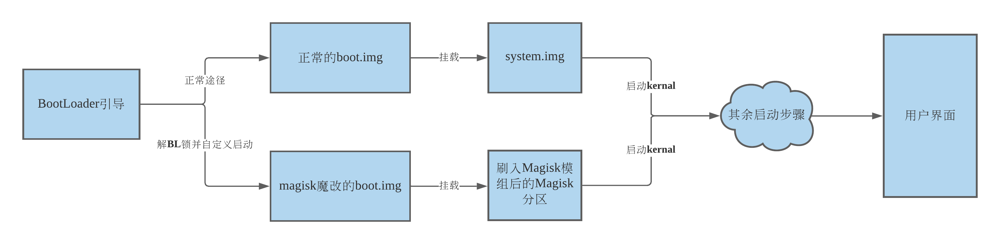
因此我们需要进行的工作就是允许系统通过我们魔改过的`boot.img`来启动，就可以实现ROOT了。

##### Magisk 模组原理
上面我们讲到magisk分区，这是一个存在于系统中只有手机启动的时候才会加载的一个分区，每一个magisk模组的刷入都是针对该分区做出改变，这里介绍一下magisk模组的基本组成：
```
module.zip
│
├── META-INF
│   └── com
│       └── google
│           └── android
│               ├── update-binary   
│               └── updater-script
├── install.sh  /* 安装时执行的脚本，常为解压当前模组压缩包到system目录并替换 */
├── system
│   └── /* 对system进行修改的源文件 */
├── module.prop /* 模组介绍 */
├── ...  /* 文件的其余部分 */
|
```
其中的脚本将会操控模组的安装，决定如何对伪system分区作出修改。
#### Edxposed 和 Riru 原理
在安卓启动过程中（见上图），kernal完成加载后将会创建Init进程，其中Init会创建`Zygote`虚拟机，顾名思义，`Zygote`是受精卵的意思，可谓安卓创世之神，所有的安卓应用都是其子进程，受其控制。`Riru`模组是一个magisk模组，它给`Edxposed`模组带来了劫持并控制（注入）`Zygote`进而完成ART Hook实现类Xposed的接口。简而言之就是可以在应用启动前就修改它，从而实现修改应用界面等功能。

## 让我们开始吧
### 一，解锁bootloader，实现自定义引导（手机数据一定丢失请注意）
> 解锁的坏处，首先是解开bootloader锁的同时，手机会恢复出厂设置，数据就没了；其次是影响官方系统升级的推送，以一加为例，原本的差量更新会因为解锁了而变成推送全量包；而且有些厂商甚至会直接不再给你提供保修，虽然解锁还可以锁回去，但还是看得出来的，因为状态不是locked而是relocked，也即这是解锁后再回锁的；还有就是解锁手机后，你乱刷机或者乱装一些插件，轻则可能导致隐私泄露、重则手机变砖……别的可能我一时间没想到，大家可以在评论里回复补充。当你充分了解以上信息，就可以着手解锁了。
> 
> --- 宁静之雨

1. 在手机开启的情况下，在终端执行
```shell
adb reboot bootloader
```
并保持手机与电脑的连接，此时手机会重启进入bootloader模式如图所示，Device state显示locked
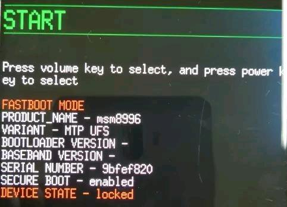
然后在终端执行
```shell
fastboot flashing unlock
```
此时手机会提示确认是否解锁，音量键选择，电源键确认，即可完成解锁。
**请注意，解锁后手机数据将会完全丢失，请确保您知道自己在做什么**
完成上述步骤后手机将会重新启动，完成登录等操作后将会进入系统

2. 制作魔改版`boot.img`
    - 下载`magisk manager`
    在magisk开发者的github上下载`magisk.apk`并安装到手机
    <https://github.com/topjohnwu/Magisk/releases>
    - **重新执行上述adb连接到手机的步骤，并确保`adb devices`能够成功读取到您的手机（此步决定了出现问题以后能否及时修复）**
    - [下载payload_dumper](../files/payload_dumper-win64.zip)并完整解压。
    - 使用压缩软件打开之前下载的氢os系统镜像，然后将其中的`payload.bin`文件放到上一步的`payload_input`文件夹里，双击exe运行
    - 待上一步运行完成，在`payload_output`文件夹中找到`boot.img`并将其发送到手机上
    - 打开手机上的`magisk manager`选择安装->选择并修补一个文件然后选择刚刚生成的`boot.img`，如图所示
    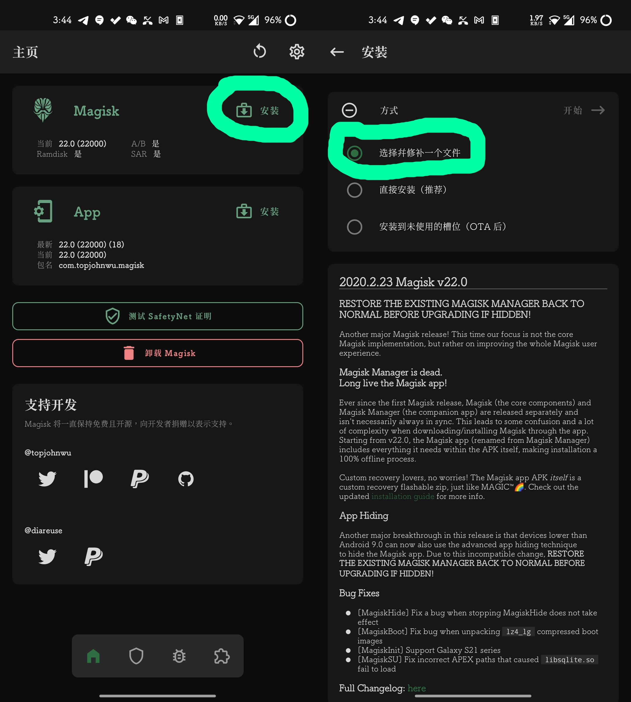
    - magisk会提示魔改后的`boot.img`存放在哪里，将这个魔改版`boot.img`传到电脑
3. 使用魔改版`boot.img`获得临时ROOT并安装完整magisk
    - 在终端执行
        ```shell
        adb reboot bootloader
        ```
        以重启至bootloader
    - 手机进入bootloader界面后，在终端执行
        ```shell
        fastboot boot xxxx.img
        ```
        `xxxx.img`为刚刚传到电脑的魔改版`boot.img`，此时手机会重启并进入系统
    - 进入系统后打开`magisk manager`并点击magisk右边的安装按钮，选择直接安装。安装完成后重启手机即完成了ROOT。

### 二，系统OTA升级注意事项（仅对于支持A/B的设备）
解锁后手机每次更新都将会推一个全量更新包，点击安装后请不要重启手机，这是因为系统的更新安装在另外一个槽位中，在这个槽位里`boot.img`为原生的并非我们需要的魔改版，因此再次打开magisk安装并选择安装到另一个槽位，安装成功后点击右下角重启即完成更新。
### 三，magisk模组的刷入
在`magisk manager`中可以见到非常多的模组，可以尝试点击安装以刷入，这里提供一些模组，可以尝试刷入
<https://shevonpeng.cn/cloud/%E8%87%AA%E5%88%B6Magisk21%E6%A8%A1%E7%BB%84/>
### 四，刷入模组后卡开机logo的解决方法
正如上文所说，有些模组出现了兼容性问题，或其他灵异问题可能导致手机卡开机logo，这个时候不要慌，先喝一口肥宅快乐水🥤，然后确保上面执行adb命令的电脑在自己的身边，然后我们开始救机。
- 使用adb连接设备，并确保确保`adb devices`能够成功读取到您的手机，若解bl锁后您没有让您手机同意来自电脑的调试，请看第五步
- 执行
    ```shell
    adb wait-for-device shell magisk --remove-modules
    ```
    来移除所有模组并重启；

- 或者您可以执行
    ```shell
    adb wait-for-device shell
    ```
    进入adb调试终端，
    然后执行
    ```shell
    su
    ```
    获取ROOT操作权限，
    使用cd进入magisk模组目录,使用ls列出所有模组
    ```shell
    cd /data/adb/modules && ls
    ```
    移除最后新增，或者您认为导致您无法开机的模组，这里以hosts为例
    ```shell
    rm -rf hosts
    ```
    最后执行
    ```shell
    reboot
    ```
    重启。整个过程如下图
    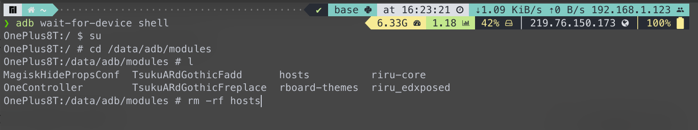

### 五，希望卸载magisk
进入booloader模式，用电脑执行
```shell
fastboot flash --slot all boot boot.img
```
注意这里的`boot.img`为原生`boot.img`并非魔改版。
### 六，刷入Edxposed
- 在`magisk manager`搜索`riru`

    **注意安装先后顺序**

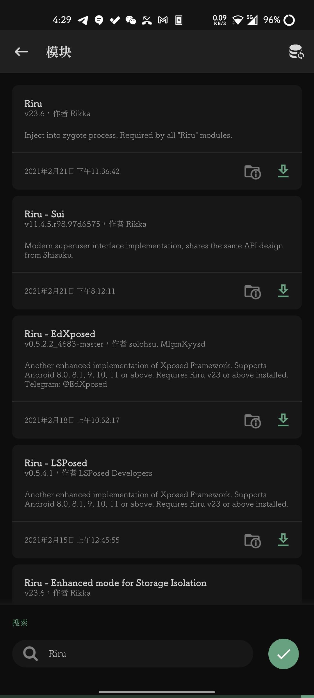

- 首先安装`Riru`模组
- 接着安装`Riru-LSPosed`或`Riru-EdXposed`模组（二选一）
- 重启
- 打开对应的应用程序，并根据提示安装模组

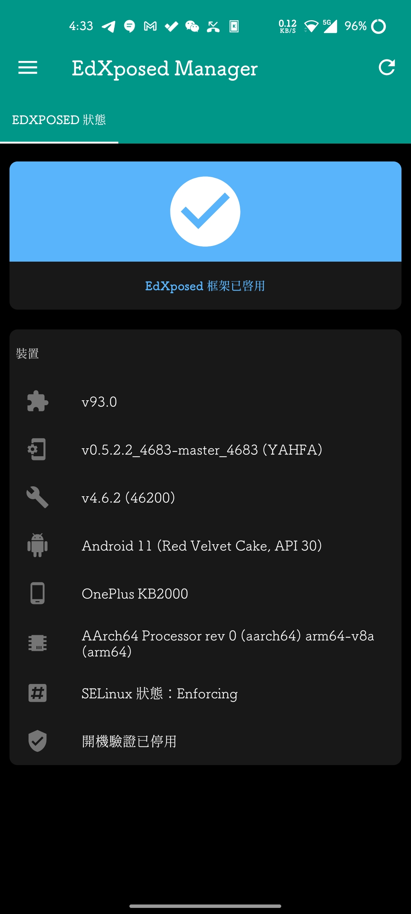


## 参考文献
[1] Android 调试桥 (adb)  |  Android 开发者  |  Android Developers. (2021). Retrieved 25 February 2021, from https://developer.android.google.cn/studio/command-line/adb

[2] Android10 动态分区介绍_UGG-CSDN博客_安卓动态分区. (2021). Retrieved 25 February 2021, from https://blog.csdn.net/u012932409/article/details/105075851