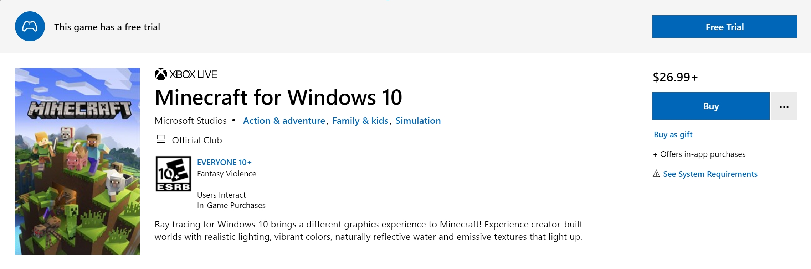

## 前言
mc基岩版即minecraft bedrock edition(以下简称mcbe)为mojang工作室使用c语言开发的全平台mc游戏,与java版不同,mcbe可以在win10,ios,android,xbox上游玩.简而言之手机,电脑甚至和主机之间都能联机玩mc了.当然这已经不是新闻了.
另外,网易代理了mc在中国的发行,这让我们这些老玩家(使用mojang账号而非网易账号的玩家)倍感不适.首先是mcbe开始分为国际版和网易版,其中网易版免费,国际版价格则水涨船高.

这使得很多教育版玩家转投网易版,暂且不评论网易版的好坏,但是网易版的出现确实使得国人很难接触到游戏更加纯净,社区更加活跃的国际版了.为了让更多人接触到国际版mcbe我决定讲讲如何搭建mcbe版服务器.

----

## 准备
### 1.获取mcbe服务器文件:
<https://www.minecraft.net/en-us/download/server/bedrock/>

官网提供的是ubuntu使用的服务器文件,这是因为该二进制文件使用了`libssl.so.1.1`等ubuntu自带的依赖文件,而这些文件在`CentOS`中并没有安装,当然逐个依赖手动编译安装也是可以的,但非常麻烦.为此这个教程将描述如何使用除ubuntu以外的Linux系统部署mcbe服务器(以`CentOS`为例).
确保您的服务器已经安装`wget`和`unzip`,若没有安装可以通过以下命令安装
```shell
[root@localhost ~] yum install wget unzip -y
```
新建一个文件夹用来存放服务器文件,并定向到该文件夹
```shell
[root@localhost ~] mkdir mcbe
[root@localhost ~] cd mcbe
[root@localhost mcbe]
```
下载服务器文件(`wget`后面的连接请右键上述网址的download按钮复制链接地址来获取)
```shell
[root@localhost mcbe] wget https://minecraft.azureedge.net/bin-linux/bedrock-server-1.16.201.02.zip
```
下载完成后解压该zip压缩包
```shell
[root@localhost mcbe] unzip bedrock-server-1.16.201.02.zip
```
解压后有以下文件(部分文件为服务器运行生成)
```shell
[root@localhost mcbe] ls -alsh                          
总用量 437M
4.0K drwxr-xr-x  14 root root 4.0K 1月  13 18:33 .
   0 drwxrwxrwx. 18 root root  248 1月  13 12:18 ..
350M -rwxr-xr-x   1 root root 350M 12月 12 09:15 bedrock_server
 86M -rw-r--r--   1 root root  86M 1月  13 12:11 bedrock-server-1.16.201.02.zip
 24K -rw-r--r--   1 root root  22K 12月 12 08:30 bedrock_server_how_to.html
   0 drwxr-xr-x  14 root root  288 12月 12 08:38 behavior_packs
   0 -rw-r--r--   1 root root    0 1月  13 21:28 Dedicated_Server.txt
   0 drwxr-xr-x   9 root root  126 12月 12 08:38 definitions
   0 drwxr-xr-x   2 root root    6 1月  13 18:33 development_behavior_packs
   0 drwxr-xr-x   2 root root    6 1月  13 18:33 development_resource_packs
   0 drwxr-xr-x   2 root root    6 1月  13 18:33 development_skin_packs
860K -rwxr-xr-x   1 root root 858K 12月 12 08:38 libCrypto.so
   0 drwxr-xr-x   2 root root    6 1月  13 18:33 minecraftpe
4.0K -rw-r--r--   1 root root    3 12月 12 08:30 permissions.json
   0 drwxr-xr-x   2 root root    6 1月  13 18:33 premium_cache
4.0K -rw-r--r--   1 root root  580 12月 12 08:30 release-notes.txt
   0 drwxr-xr-x   4 root root   38 12月 12 08:38 resource_packs
4.0K -rw-r--r--   1 root root 3.7K 1月  13 20:21 server.properties
   0 drwxr-xr-x  14 root root  207 12月 12 08:38 structures
   0 drwxr-xr-x   3 root root   30 1月  13 18:33 treatments
4.0K -rw-r--r--   1 root root 2.6K 1月  13 20:03 valid_known_packs.json
4.0K -rw-r--r--   1 root root    3 12月 12 08:30 whitelist.json
   0 drwxr-xr-x   3 root root   27 1月  13 18:33 worlds
   0 drwxr-xr-x   2 root root    6 1月  13 18:33 world_templates
```
其中`bedrock_server_how_to.html`文件为如何配置服务器的教程.
> 若您使用的是ubuntu16及以上系统请完成该步后阅读启动服务器一节

### 2.创建`docker`运行环境
卸载自带docker环境同时安装所需软件包
```shell
[root@localhost ~] yum remove docker \
                    docker-client \
                    docker-client-latest \
                    docker-common \
                    docker-latest \
                    docker-latest-logrotate \
                    docker-logrotate \
                    docker-engine
[root@localhost ~] yum install -y yum-utils \
                    device-mapper-persistent-data \
                    lvm2
```
使用阿里云docker镜像源安装docker
```shell
[root@localhost ~] yum-config-manager \
                    --add-repo \
                    http://mirrors.aliyun.com/docker-ce/linux/centos/docker-ce.repo
[root@localhost ~] yum install docker-ce docker-ce-cli containerd.io
```
启动docker不允许开机自启动
```shell
[root@localhost ~] systemctl start docker.service
[root@localhost ~] systemctl enable docker.service
```
然后拉取ubutu的镜像
```shell
[root@localhost ~] docker pull ubuntu
```
下载成功后可以通过以下命令查看已经拉取的镜像
```shell
[root@localhost ~] docker images   
REPOSITORY   TAG       IMAGE ID       CREATED       SIZE
ubuntu       latest    f643c72bc252   6 weeks ago   72.9MB
```
使用该镜像创建一个容器
```shell
[root@localhost ~] docker run -dit -p 19132:19132/udp -v /mcbe:/mcbe --restart=always ubuntu:latest /bin/bash
```
> 上面这条命令不要错一个字母哦
> `docker run`指`creat`一个容器然后`start`,`-d`意思是进程守护模式`-it`打开标准输入伪终端,三个参数缺一不可.`-p 19132:19132`表示将容器内19132端口(mcbe服务默认端口(后者)映射到宿主机19132端口(前者)),mcbe使用的是udp协议故加上`/udp`.`-v /mcbe:/mcbe`表示将宿主机中的mcbe文件夹(第一步建立的)映射(挂载)到容器中的mcbe文件夹中,更多信息请阅读docker指南.
查看容器新建状态(若上一步建立成功,您将看到类似的输出)
```shell
[root@localhost ~] docker ps
CONTAINER ID   IMAGE           COMMAND       CREATED       STATUS       PORTS                     
9492733161d5   ubuntu:latest   "/bin/bash"   3 hours ago   Up 3 hours   0.0.0.0:19132->19132/udp
```
重命名容器为mcbe
```shell
[root@localhost ~] docker rename 9492733161d5 mcbe
```
进入该容器(切忌使用`attach`命令)(使用exit)
```shell
[root@localhost ~] docker exec -it mcbe /bin/bash
root@9492733161d5:/# 
```
注意见到已生成一个伪终端且该终端的提示符为ubuntu的提示形式
### 3.启动服务器
若您使用ubuntu系统并已完成第一步或者您已经部署完容器,那么我们离成功不远了,从这里开始我们就进入到了服务器的启动了
#### 3-*.安装`screen`(docker用户跳过直接进入3-1)并建立一个screen
```shell
root@localhost:/ apt-get install screen -y
root@localhost:/ screen -S mcbe
```
`screen`命令可以建立一个伪终端并能常驻后台运行可以使用`screen -r mcbe`命令来返回该伪终端.
#### 3-1.启动mcbe服务器
```shell
root@localhost:/ cd mcbe
root@localhost:/ LD_LIBRARY_PATH=. ./bedrock_server
```
关于服务器的管理详见`bedrock_server_how_to.html`.
#### 3-*.开放防火墙(ubuntu用户跳过)
退出容器
```shell
root@localhost:/ exit
[root@localhost ~] 
```
开放防火墙
```shell
[root@localhost ~] firewall-cmd --add-port=19132/tcp --permanent
[root@localhost ~] firewall-cmd --reload
```
至此为止已完成mcbe服务器的部署.
### 连接进mcbe服务器
