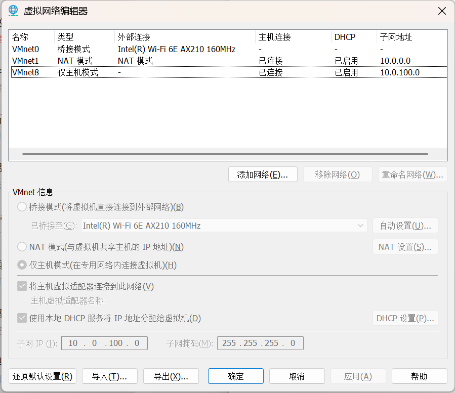
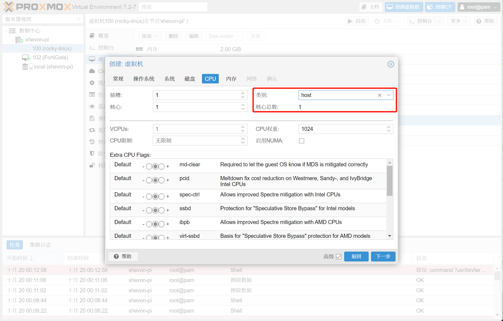

## 前言
树莓派4b作为HomeLab的核心，怎么可以少了虚拟机。另外可以配套`openwrt`等路由器虚拟机这样比单独将这些系统安装到树莓派更方便而且更具有可玩性。

> Proxmox VE 是一个完整的、开源的企业虚拟化服务器管理平台。 它将 KVM 管理程序和 Linux 容器 (LXC)、软件定义的存储和网络功能紧密集成在一个平台上。 借助基于 Web 的集成用户界面，您可以轻松管理 VM 和容器、集群的高可用性或集成的灾难恢复工具。

**该教程仅限交流、学习使用，请遵守当地法律法规，同时请在各系统的开源许可规定下合法使用，**

## 准备
### 添加软件源

　编辑 `/etc/apt/sources.list` 文件，在下方添加以下两行内容：

```shell
deb https://raw.githubusercontent.com/pimox/pimox7/master/ dev/
deb http://mirrors.cloud.tencent.com/raspberrypi bullseye main
```
　执行
```shell
curl https://raw.githubusercontent.com/pimox/pimox7/master/KEY.gpg | sudo apt-key add –
```

以安装 pve7 的 gpg 公钥。

### 安装Proxmox VE

更新apt源

```shell
apt update
```

安装pve（建议该步使用串口执行，以免因网络变化导致安装失败）

```shell
apt install -y proxmox-ve
```

### 修改内核参数以允许内核转发

后面需要为路由器虚拟机配置三层网桥同时需要使用到透明代理故此步不可忽略。

编辑 `/etc/sysctl.conf` 文件，添加以下内容：

```ini
vm.overcommit_memory=1
net.ipv4.ip_forward=1
net.ipv4.conf.all.rp_filter=1
net.ipv4.icmp_echo_ignore_broadcasts=1
net.ipv4.conf.default.forwarding=1
net.ipv4.conf.default.proxy_arp=0
net.ipv4.conf.default.send_redirects=1
net.ipv4.conf.all.send_redirects=0
```
保存后执行 `sysctl -p` 或重启生效。

## 配置和使用

考虑到以下两个问题

1. FortiGate-VM启动后会通过DHCP自动获取ip地址，由于树莓派的显卡无法通过kvm驱动，因此无法直接使用命令行对其地址进行修改；

2. pve只支持`网桥`作为网络端口连接到虚拟机，因此想要虚拟机使用树莓派的有线网口我们需要先将该网卡绑定到一个二级网桥。

我们先对pve进行初始的网络配置

### 网络初始化配置

1. 将树莓派的网口和带有DHCP服务的路由器连接，使用`ip addr`命令查看网口`eth0`获得的IP地址

2. 电脑连接到相同路由器，浏览器访问第一步获得的ip地址加端口`8006`访问pve的控制台


3. 这里输入自己的管理员用户名和密码（同树莓派的登录账号密码）

   

4. 添加一个linux网桥作为二层交换机，以使新建的虚拟机可以通过该网桥直连网络。如下图所示添加网桥，pve中的网桥都会以`vmbr*`命名，图中使用`vmbr2`只是因为我是最后新建这个网桥的。这一套路由器系统总共需要用到3个网桥，可以一次性新建完。`vmbr1`我将作为路由器虚拟机的`WAN`口来使用，`vmbr0`将作为路由器虚拟机的`LAN`口使用，`vmbr2`将作直连树莓派自身网卡使用。
   
   

   目前的网络拓扑如下图
   
   
   
   使用`brctl`命令查看网桥创建情况
   
   ```shell
   root@shevon-pi:~# brctl show
   bridge name     bridge id               STP enabled     interfaces
   vmbr0           8000.fe3a3860fdbd       no              
   vmbr1           8000.5e6f07ca4255       no              
   vmbr2           8000.2e495d446aa8       no              eth0
   ```
   
5. 将`vmbr1`改为具有三层交换功能的网桥（该功能需开启内核转发，详见上文）。这样可以方便我们路由路由器虚拟机的流量。这里需要我们修改网卡配置文件。编辑`/etc/network/interfaces`文件，将`vmbr1`的配置位置修改为

   ```
   auto vmbr1
   iface vmbr1 inet static
       address 192.168.0.1/24 # 三层交换网桥的地址（将作为网关地址）
       bridge-ports none
       bridge-stp off
       bridge-fd 0
       post-up iptables -t nat -A POSTROUTING -s '192.168.0.0/24' -o vmbr0 -j MASQUERADE # 设置三层交换的下一跳路由，将来源于这个ip段的流量路由到vmbr0网卡
   ```

   > 要注意，网桥在Linux系统中的意义不完全等同于三层物理交换机，设置交换机的时候我们可以设置下一跳为`0.0.0.0->上游路由器`但这里必须限制网段，因为所有流量都经由Linux内核处理，这里是通过把规则添加到`postrouting`链实现的，如果使用`0.0.0.0`则会导致所有流量都经由这个规则，这并非我们希望的路由在这个网桥上产生的流量。（多说一句，即使配置三层交换机，也不应该将`0.0.0.0->上游路由器`作为缺省路由，这即不利于多网段布网，也不利于流量安全控制）。

   在这里我们可以设置三层交换的网段，部署在这个网桥下面的虚拟机将使用这个网段，后面我们将把路由器虚拟机的`WAN`口接上这个路由。该网桥并没有配置`DHCP`功能，因此在该网桥下的虚拟机需要手动设置ip地址，当然你也可以使用linux自带的dhcp服务`dhcpd`来为该网桥开启`DHCP`功能，考虑到虚拟机数量不多，这一步就不写啦。

5. 到这里，我们就已经完成了pve的整个网络配置了，如果读者使用过`VMware Workstations pro`应该不难发现其网络功能我们都已经实现了。`vmbr1`即`Workstation pro`中的`NAT模式`，`vmbr2`即`桥接模式`。


## pve基础

### 本地储存


在左边选中`数据中心`可以在储存概要中见到，自动新建的储存池`local`已作为默认储存。其位于`/var/lib/vz`目录，该目录下有5个子目录分别为

1. dump  用于储存VZDump备份文件
2. images  用于储存硬盘映像和快照
3. private  /(ㄒoㄒ)/~~我也不知道这个是干啥的
4. snippets  用于储存片段
5. template 用于储存虚拟机模板，iso等文件

### pve的命令行控制

pve使用`pvesh`作为其命令行管理工具，有以下用法：

查看集群运行状态

```shell
pvesh get /cluster/resources
```

取得虚拟机当前状态

```shell
pvesh get /nodes/PVE主机名称/qemu/虚拟机的id/status/current
```

启动虚拟机

```shell
pvesh create /nodes/PVE主机名称/qemu/虚拟机的id/status/start
```

关闭虚拟机

```shell
pvesh create /nodes/PVE主机名称/qemu/虚拟机的id/status/stop
```

重设虚拟机

```shell
pvesh create /nodes/PVE主机名称/qemu/虚拟机的id/status/reset
```

## 装一个Rocket Linux试试

CentOS已经不是以前的Cent呢，因此我选Rocky Linux，一个很不错的替代品，它的软件源也比较新。

1. 打开[Download Rocky | Rocky Linux](https://rockylinux.org/download)复制`ARM64(aarch64) Mininal`的下载链接。使用`wget`下载到`/var/lib/vz/template/iso`目录。这是我下载的版本。

```
cd /var/lib/vz/template/iso
wget https://download.rockylinux.org/pub/rocky/9/isos/aarch64/Rocky-9.0-20220805.0-aarch64-minimal.iso
```
2. 点击右上角创建虚拟机进入虚拟机创建向导，勾选右下角的高级选项框。输入虚拟机的名称然后点下一步。
   
3. 选择`不使用任何介质`，这是因为默认的iso文件不是通过scsi驱动的，会导致读取失败，我们将在完成新建以后再添加光驱。
   
4. `BIOS`选项选择`OVMF (UEFI)`以启用`UEFI`启动，添加`UEFI`启动所需的EFI硬盘，这里建议使用`qcow2`格式以保证性能。
   
5. 根据实际需要添加硬盘。
   
6. cpu类型选择`host`以保证性能和兼容性。
   
7. 根据需要设置内存大小。
   
8. 根据需要选择接入的网卡，这里建议勾选`无网络设备`，在创建完虚拟机后再添加。`VirtIO (半虚拟化)`模型拥有比较好的性能和稳定性。
   
9. 添加`vmbr2`作为网络设备并关闭防火墙。
   
10. 添加Rocket Linux的启动镜像，注意选择`SCSI`总线
   
11. 安装完成后我们可以进入控制台来使用这台虚拟机
   

现在的网络架构如图所示，后续我们将继承这套网络设置。


## 参考文献

[1] [TUTORIAL] - How to run PVE 7 on a Raspberry Pi. Retrieved 14 October 2022, from https://forum.proxmox.com/threads/how-to-run-pve-7-on-a-raspberry-pi.95658/

[2] pvesh(1) (proxmox.com). Retrieved 14 October 2022, from https://pve.proxmox.com/pve-docs/pvesh.1.html
