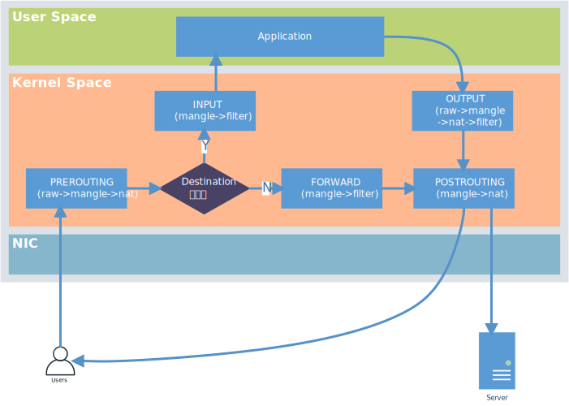

## 前言
这一部分将用来讲解Linux路由和如何使用xray透明代理。使用xray透明代理可以实现绕过校园网认证。这篇以及下一篇会涉及到非常多的网络变动，为了保证局域网的稳定性后面将会把树莓派自带网卡用作路由器`LAN`口，因此如果读者之前使用树莓派网口来连接调试，请从这里开始使用显示器和键盘或串口来调试树莓派。

### 三种代理方式

#### 正向代理

正向代理是代理方式中最重要的一种，其原理是用户和代理服务器之间通过一定的协议栈，比如socks等，来实现用户通过将代理服务器作为跳板机来访问其他服务器。这时，被访问的服务器只能获取到代理服务器的地址信息，换而言之，真正的用户地址信息因为代理服务器的转发而被隐藏，其特点是，用户可以通过代理服务器实现对代理服务器能够访问到的机器的访问。

#### 反向代理

反向代理和正向代理最大的区别在于，使用用户不会把反向代理服务器当作代理服务器而是认为反向代理服务器是自己需要访问的目标服务器。因此与正向代理最大的区别在于，反向代理不需要用户侧安装相应的代理软件和使用代理协议，但是需要在反向代理服务器配置需要被反代的目标服务器地址。反代服务器常常用来做网站出口负载均衡。简单的理解，正向代理服务器是某些用户访问大量服务器，反向代理是所有用户访问部分服务器（没有绝对关系，单纯方便理解才提出来的，因为正向代理需要在用户侧和代理侧同时配置，而反向代理只需要在代理侧配置）。

#### 透明代理

透明代理是一种神奇的代理方式，可以让用户不知道自己被代理，这种代理方式不需要用户安装代理软件。这里我们打算用透明代理来实现树莓派自身的上网和树莓派作路由器都能被代理到的功能。

### iptables原理

Linux 使用`Netfilter`来管理网络，`Netfilter`模型如上图所示。iptables和nftables通过

## 参考文献
[1] 透明代理入门 | Project X. (2022). Retrieved 19 October 2022, from https://xtls.github.io/document/level-2/transparent_proxy/transparent_proxy.html#%E4%BB%80%E4%B9%88%E6%98%AF%E9%80%8F%E6%98%8E%E4%BB%A3%E7%90%86

[2] GID 透明代理 | Project X. (2022). Retrieved 19 October 2022, from https://xtls.github.io/document/level-2/iptables_gid.html#%E6%80%9D%E8%B7%AF

[3] 透明代理(TPROXY) | 新 V2Ray 白话文指南. (2022). Retrieved 19 October 2022, from https://guide.v2fly.org/app/tproxy.html#%E8%AE%BE%E7%BD%AE%E7%BD%91%E5%85%B3

[4] TProxy 透明代理 | Project X. (2022). Retrieved 19 October 2022, from https://xtls.github.io/document/level-2/tproxy.html#netfilter-%E9%85%8D%E7%BD%AE

