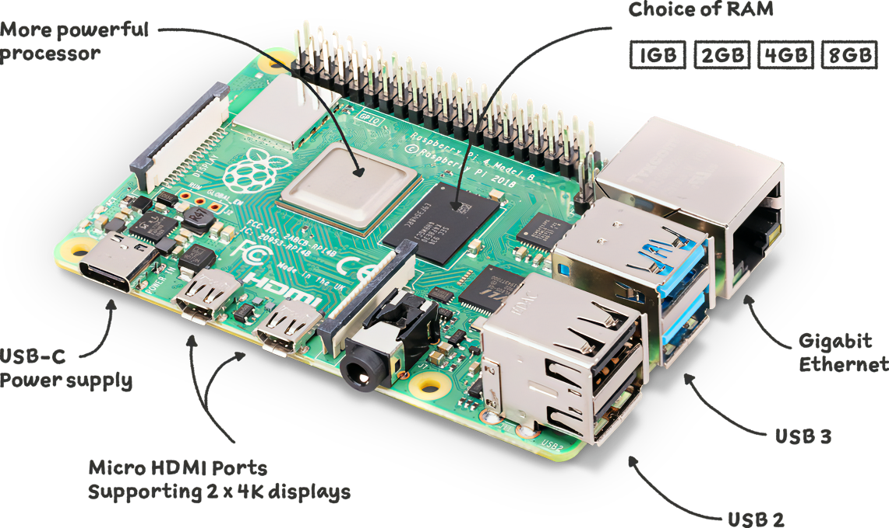

## 前言
树莓派4b作为理财产品现在溢价非常多，以现在的价格来评论树莓派的性价比确实不太合理。但不可否认的是，它的性能直到今天应付HomeLab还是绰绰有余的呢。另外树莓派也非常适合新手入门Linux系统，唯一不太友好的或许是ARM架构产生的小问题吧。在这里我用树莓派4b作为宿舍路由器和HomeLab核心设备，并将用几篇文章来讲解整个搭建过程。然后咧，我希望读者能将这几篇文章当作我的随笔来看待，因为作为教程，需要足够系统以及详细的讲解，这里可能都没有。

阅读该教程需要一定的Linux基础，包括但不限于对`systemd`，`apt包管理`，`Linux账户系统`，`swap`，`iptables四表五链`，`路由表`等方面的了解。

准备分成以下几篇文章来记录这个过程：
- 与树莓派相关的一些介绍和讲解
- 在树莓派上部署和使用pve虚拟化
- Linux路由和xray透明代理
- FortiGate-VM防火墙的相关介绍
- 使用oled12864作为路由器的指示器

**该教程仅限交流、学习使用，请遵守当地法律法规，合法使用**

## 树莓派4b硬件


1. CPU：博通的BCM2711，4核64位ARM Cortex-A72架构，1MB的L2。性能接近于apple的A8，是远远比不上骁龙865等高端手机cpu的

2. 内存：LPDDR4-2400MHz，有3种大小的，我的是4G的

3. 5V 3A的供电

4. 2个USB 2.0和2个USB 3.0

5. 一个千兆网口

6. 支持2.4G和5G的IEEE 802.11ac垃圾小wlan网卡

7. 蓝牙5.0

8. ……

### GPIO介绍

   

树莓派的GPIO如上图所示，整个过程将会用到其中不少的接口。

## Raspberry Pi OS的安装和配置
### 安装Raspberry Pi OS
根据[官网教程](https://www.raspberrypi.com/documentation/computers/getting-started.html#downloading-an-image)下载并安装`Raspberry Pi Imager`，启动后选择对应的储存卡并安装`Raspberry Pi OS Lite (64bit)`系统，等待完成提示。


### `config.txt`配置文件

在将TF卡插入树莓派之前，可以修改一下这个神奇的文件，直接用资源管理器打开刚刚安装完系统的储存卡，可以见到`config.txt`这个文件，下面我将对这个文件进行修改。官网有关于`config.txt`的详细介绍，见[Raspberry Pi Documentation - The config.txt file](https://www.raspberrypi.com/documentation/computers/config_txt.html)。这里具体讲讲我都修改了哪些选项，以及为啥需要修改：

```ini	
# 树莓派超频设置
arm_freq=2200
over_voltage=7
temp_limit=100
temp_soft_limit=100
arm_boost=1
# 启用树莓派i2c功能
dtparam=i2c_arm=on
dtparam=i2c_baudrate=1000000
# 启用树莓派uart功能
enable_uart=1
# 使用64位
arm_64bit=1
```

在这里我修改了树莓派的超频选项，并将频率拉到2200MHz，多次尝试发现，`over_voltage`参数设置到7运行比较稳定。启用树莓派的i2c功能是为了后续我们可以使用I2C来连接oled屏幕。启用uart功能是为了实现串口调试。

### 使用uart连接树莓派

如果没有显示器和键盘，那么用串口调试树莓派不失为一不错的解决。后面的教程中将会涉及到非常多网络配置，更改网络和路由设置可能会导致ssh断连，所以使用串口调试可以有效避免这些问题。

首先咧，需要一张usb转串口通信模块，它长这样子。然后再对应上面那张GPIO的图，分别将通信模块的`TXD` `RXD` `GND`连接到树莓派的`RXD` `TXD` `GND`，这里需交叉连接`TXD`和`RXD`，以确保信号上下行能正常进行。然后用电脑连接串口模块，常用的串口软件有`putty`，`xshell`和`secureCRT`等。设置波特率`115200`，数据位`8`，停止位`1`，奇偶校验选`无`，流控制选`XON/XOFF`即可通过串口连接树莓派。


### 基本配置

#### WLAN设置

首先我们来看树莓派自带的wifi模块设置，可以通过`systemd`来管理

```
systemctl status hostapd
● hostapd.service - Access point and authentication server for Wi-Fi and Ethernet
     Loaded: loaded (/lib/systemd/system/hostapd.service; disabled; vendor preset: enabled)
     Active: inactive (dead)
       Docs: man:hostapd(8)
```

该模块的配置文件为`/etc/hostapd/hostapd.conf`（可能需要新建），

```ini
country_code=CN
interface=wlan0
# wifi桥接模式，指定网桥
bridge=vmbr2
ssid=FortiAP
# IEEE 802.11标准选择
hw_mode=a
# 信道
channel=48
macaddr_acl=0
auth_algs=1
# 是否开启ssid发现
ignore_broadcast_ssid=0
# wifi安全性设置
wpa=2
wpa_passphrase=guanshuwen731008
wpa_key_mgmt=WPA-PSK
wpa_pairwise=TKIP
rsn_pairwise=CCMP
```

#### I2C设置

常用命令`raspi-config`对树莓派进行简单配置，这里我们使用该命令开启`I2C`功能以方便我们连接oled设备，当然您也可以从官网阅读有关`spi`的相关配置，考虑到`I2C`设备连接更简单，且可以并联，所以我选择了`I2C`连接的oled12864。

输入上述命令进入树莓派设置清单，选择`3 Interface Options`接口配置，选中`I2C`设置。


出现以下提示后选择yes并重启树莓派。


#### 树莓派扩容

默认安装后的树莓派不会占满TF卡，我们可以通过使用自带的扩容工具完成扩容。

同样是运行`raspi-config`，这次我们选择`6 Advanced Options`


然后选择`A1 Expand Filesystem`，重启后即可完成扩容操作。


#### 更改swap大小

树莓派默认的swap非常小，这对于后续运行虚拟机来说，容易出现内存溢出的错误，可以通过编辑`/etc/dphys-swapfile`文件来修改swap大小，这里我改为4G。

```shell
vim /etc/dphys-swapfile
```


#### 基础网络配置

`Raspberry Pi OS`基于debian构建因此网络配置也可以通过修改`/etc/network/interfaces`文件完成，具体见该教程下一篇。
